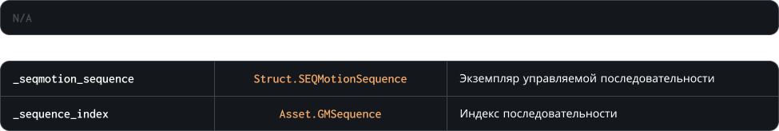

##  Возможности

`SEQMotion.DrawSequence( seqmotion_sequence, frame, x, y, xscale, yscale, rotation )`

Отрисовка управляемой последовательности

  

`SEQMotion.SetSequence( seqmotion_sequence, frame, x, y, xscale, yscale, rotation )`

       

`SEQMotion.CreateSequence( sequence_index )`

`SEQMotion.DeleteSequence( seqmotion_sequence )`

`SEQMotion.GetSequence( seqmotion_sequence, frame, x, y, xscale, yscale, rotation )`
