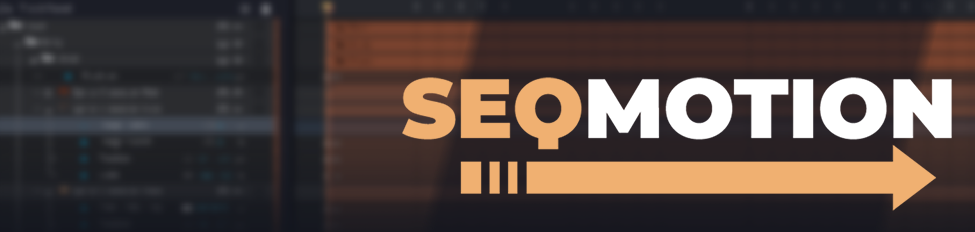
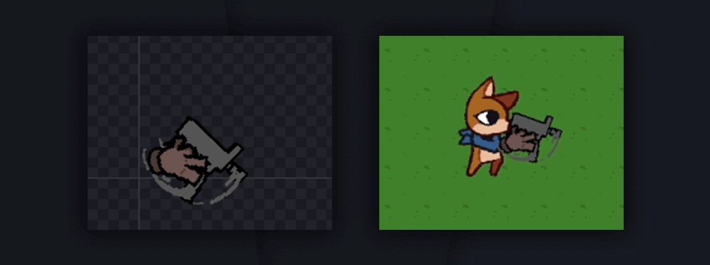

**SEQMotion** — расширение, позволяющее использовать последовательности более гибко, создавая из них комплексные системы динамических анимаций персонажей, окружения или эффектов. Встроенный в сам **GameMaker** редактор последовательностей наконец-то станет чуть более полезным~

## Установка

Скачайте [последнюю версию расширения](https://github.com/veewee-cat/SEQMotion/releases/latest) и установите ее в ваш проект через: `Tools` -> `Import Local Package` 
Ничего больше настраивать не нужно, расширение будет работать с самого запуска вашей игры 
Подробно о том, как работать с этим расширением описано в [документации](docs/ru/.md)

В случае обнаружения какого-то бага или на случай, если у вас есть какие-либо пожелания, которые можно было бы рассмотреть в последующих обновлениях — вы можете оставлять свои сообщения [здесь](https://github.com/veewee-cat/SEQMotion/issues/new/choose)
