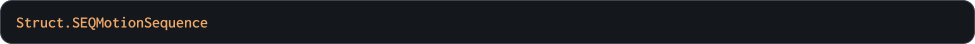
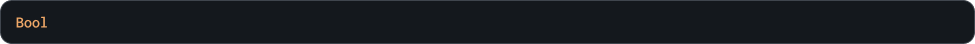

## Методы

<!--------------------------------------------------------------------------------------------------------->

> ### CreateSequence

Создание экземпляра управляемой последовательности. При указании индекса существующей последовательности она становится текущей при первом вызове [UpdateSequence](#updatesequence). Параметр `_sequence_index` является необязательным, его можно будет установить позже, используя метод `SetSequence`

`Внимание!` Не забудьте удалить экземпляр управляемой последовательности из памяти после того, как закончите им пользоваться. В противном случае возможна утечка памяти. Используйте для этого метод `DeleteSequence`

### Синтаксис

```c#
SEQMotion.CreateSequence( _sequence_index )
```

### Параметры метода


### Возвращаемое значение



### Пример

```c#
character = SEQMotion.CreateSequence( Sequence_Character_Idle );
```

Код выше создаст новый экземпляр управляемой последовательности и сохранит его уникальный идентификатор в переменную `character`

<!--------------------------------------------------------------------------------------------------------->

<br>
<br>
<br>
<br>
<br>

<!--------------------------------------------------------------------------------------------------------->

> ### SequenceExists

Так как экземпляры управляемой последовательности являются динамичными данными, с помощью этого метода можно проверить существование конкретного экземпляра по его уникальному идентификатору, что возвращает метод [CreateSequence](#createsequence) при создании

### Синтаксис

```c#
SEQMotion.SequenceExists( _seqmotion_sequence_id )
```

### Параметры метода


### Возвращаемое значение



### Пример

```c#
if ( SEQMotion.SequenceExists( character ) ) SEQMotion.UpdateSequence( character, x, y, depth );
```

Код выше проверит существование экземпляра управляемой последовательности character, и если он существует — обновит его позицию и глубину отрисовки

<!--------------------------------------------------------------------------------------------------------->

<br>
<br>
<br>
<br>
<br>

<!--------------------------------------------------------------------------------------------------------->

> ### DeleteSequence

Удаление конкретного экземпляра управляемой последовательности из памяти. После удаления указатель, сохраненный ранее будет недействительным и попытки использовать его в параметрах методов расширения приведут к вызову ошибки

### Синтаксис

```c#
SEQMotion.DeleteSequence( _seqmotion_sequence_id )
```

### Параметры метода


### Возвращаемое значение


### Пример

```c#
hands = SEQMotion.CreateSequence( Sequence_Character_Hands_Idle );
        SEQMotion.DeleteSequence( hands );
```

Код выше удалит из памяти ранее созданный экземпляр управляемой последовательности `hands`

<!--------------------------------------------------------------------------------------------------------->

<br>
<br>
<br>
<br>
<br>

<!--------------------------------------------------------------------------------------------------------->

> ### UpdateSequence

Обновление экземпляра управляемой последовательности. Метод изменяет позицию и глубину отрисовки указанного экземпляра. Если параметры `_x`, `_y` и `_depth` не заданы или в качестве значения указана константа `undefined`, игра будет использовать данные экземпляра предыдущего кадра, когда был вызван метод

### Синтаксис

```c#
SEQMotion.UpdateSequence( _seqmotion_sequence_id, _x, _y, _depth )
```

### Параметры метода


### Возвращаемое значение


### Пример

```c#
SEQMotion.UpdateSequence( character, undefined, y );
```

Код выше обновит позицию экземпляра по вертикали, при этом позиция по горизонтали и глубина отрисовки будут неизменны относительно значений предыдущего кадра, когда был вызван метод

<!--------------------------------------------------------------------------------------------------------->

<br>
<br>
<br>
<br>
<br>

<!--------------------------------------------------------------------------------------------------------->
