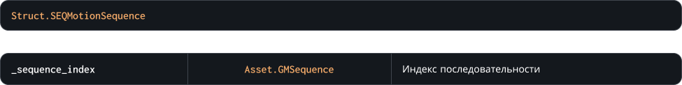
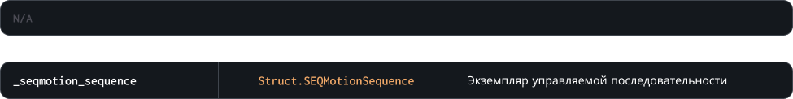
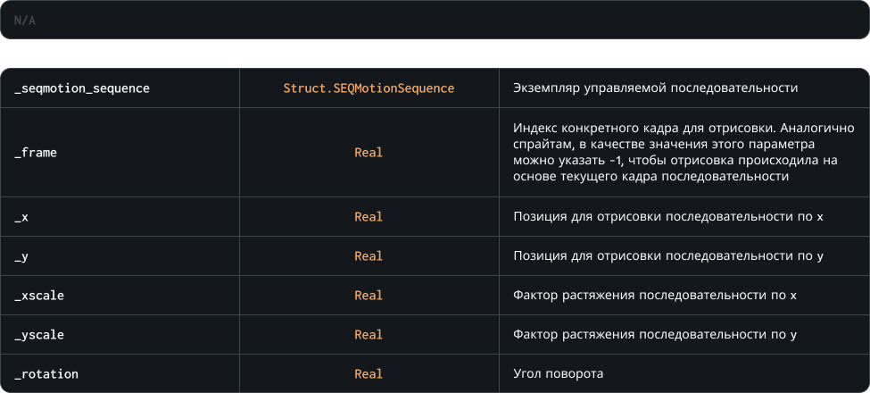
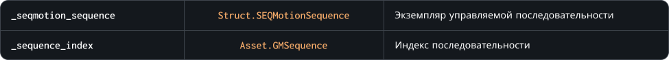

## Методы

- [CreateSEQMotionSequence](#createseqmotionsequence)
- [CreateSEQMotionSequenceDynamic](#createseqmotionsequencedynamic)
- [DeleteSEQMotionSequence](#deleteseqmotionsequence)
- [DrawSEQMotionSequence](#drawseqmotionsequence)
- [SetSequence](#setsequence)
- [GetSequence](#getsequence)

## CreateSEQMotionSequence

Создание экземпляра простой управляемой последовательности<br>
Метод возвращает указатель на струтуру управляемой последовательности, который нужно передавать в других методах ниже

**Внимание!** Подход отрисовки экземпляра, созданного этим методом имеет ряд ограничений и может обрабатывать только спрайты и их группы. Если вы хотите создать управляемую последовательность, что будет использовать все возможности редактора — используйте метод `SEQMotion.CreateSEQMotionSequenceDynamic`

**Внимание!** После того, как вы закончили использование управляемой последовательности удалите ее из памяти методом `DeleteSEQMotionSequence`, в противном случае экземпляр останется висеть в памяти

<br>

### Синтаксис
```c
SEQMotion.CreateSEQMotionSequence( _sequence_index )
```

### Параметры метода


### Возвращаемое значение


<br>
<br>
<br>

## CreateSEQMotionSequenceDynamic

Создание экземпляра динамичной управляемой последовательности, что может использовать все возможности редактора<br>
Метод возвращает указатель на струтуру управляемой последовательности, который нужно передавать в других методах ниже

**Внимание!** Подход к отрисовке этого типа последовательностей очень ресурсозатратный, используйте его осторожно

**Внимание!** После того, как вы закончили использование управляемой последовательности удалите ее из памяти методом `DeleteSEQMotionSequence`, в противном случае экземпляр останется висеть в памяти

<br>

### Синтаксис
```c
SEQMotion.CreateSEQMotionSequenceDynamic( _sequence_index )
```

### Параметры метода


### Возвращаемое значение


<br>
<br>
<br>

## DeleteSEQMotionSequence

Удаление из памяти экземпляра управляемой последовательности, созданного ранее, с помощью метода `CreateSEQMotionSequence`<br>
Внимание! После удаления к экзепляру управляемой последовательности все еще можно обращаться — его указатель будет актуальным, но методы отрисовки и изменения параметров / состояний не будут работать ( речь про `SetSequence` и ему подобные )

<br>

### Синтаксис
```c
SEQMotion.DeleteSEQMotionSequence( _seqmotion_sequence )
```

### Параметры метода


### Возвращаемое значение


<br>
<br>
<br>

## DrawSEQMotionSequence

Отрисовка управляемой последовательности<br>
Расчет данных каналов последовательности происходит на основе указанного в параметрах функции кадра, аналогично работе со спрайтами: если указать `frame = -1` игра будет отрисовывать текущий кадр последовательности *как оно есть*

При отрисовке можно менять общие параметры трансформации изображения ( самой последовательности ), а именно: размер ( `xscale` / `yscale` ) и поворот ( `rotation` ), относительно центральной точки

<br>

### Синтаксис
```c
SEQMotion.DrawSEQMotionSequence( _seqmotion_sequence, _frame, _x, _y, _xscale, _yscale, _rotation )
```

### Параметры метода


### Возвращаемое значение


<br>
<br>
<br>

## SetSequence

Изменение индекса экземпляра последовательности управляемой последовательности<br>
Метод позволяет переключаться между ассетами, создавая более сложные системы анимаций. В качестве указателя на индекс последовательности можно указать значение `-1` — это очистит данные текущего экземпляра

<br>

### Синтаксис
```c
SEQMotion.SetSequence( _seqmotion_sequence, _sequence_index )
```

### Параметры метода


### Возвращаемое значение


<br>
<br>
<br>

## GetSequence

С помощью этого метода можно получить указатель на текущий экземпляр последовательности. В случае, если у управляемой последовательности не указан экземпляр текущей последовательности будет возвращено значение `undefined`

<br>

### Синтаксис
```c
SEQMotion.GetSequence( _seqmotion_sequence )
```

### Параметры метода


### Возвращаемое значение

