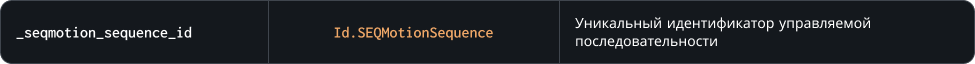

### `GetAnimationSpeed`

Метод возвращает множительно скорости анимации управляемой последовательности, аналогичный возвращаемому значению функции [layer_sequence_get_speedscale](https://manual.gamemaker.io/beta/en/GameMaker_Language/GML_Reference/Asset_Management/Rooms/Sequence_Layers/layer_sequence_get_speedscale.htm)
`Внимание!` Множитель скорости проигрывания анимации и значение **playback-скорости** в редакторе последовательностей это разные значения

### Синтаксис

```c#
SEQMotion.GetAnimationSpeed( _seqmotion_sequence_id )
```

### Параметры метода



### Возвращаемое значение


### Пример

```c#
if ( SEQMotion.GetAnimationSpeed( character ) == 0 )
{
  SEQMotion.SetSequence( character, Sequence_Character_Idle );
  SEQMotion.SetAnimationSpeed( character, 1 );
};
```

Код выше проверяет текущую скорость проигрывания анимации, и если она нулевая, то меняет индекс последовательности экземпляра управляемой последовательности `character`
