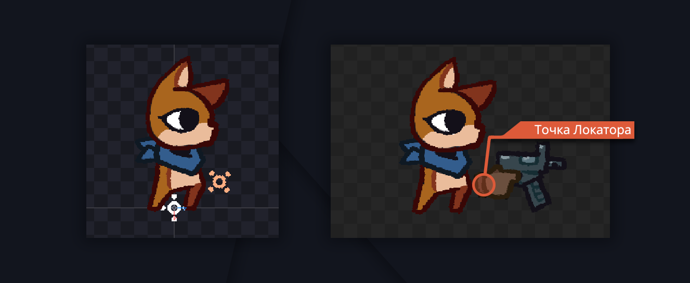
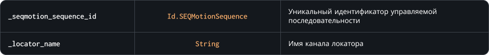

### `GetLocatorData`

Метод возвращает структуру данных [локатора](/) в текущем кадре анимации по имени его канала в [редакторе последовательностей](/).
Если локатора с указанным именем не существует, метод вернет значение `undefined`<br>
В структуре описана позиция относительно комнаты: `x` и `y`, — а также угол наклона локатора `rotation`



### Синтаксис

```c#
SEQMotion.GetLocatorData( _seqmotion_index, _locator_name )
```

### Параметры метода



### Возвращаемое значение


<br>
<br>

### Пример

```c#
var _locator = SEQMotion.GetLocatorData( gun, "BulletPoint" );

if ( not is_undefined( _locator ) )
{
	var _bullet = instance_create_layer( _locator.x, _locator.y, "Bullets", Object_Bullet );
		_bullet.direction = _locator.rotation;
};
```

Код выше делает попытку получить данные локатора и если они валидны, то создает экземпляр объекта пули на его месте и передает направление самого локатора, как направление полета пули
