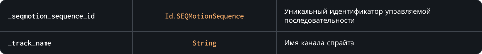

### `GetTrackSprite`

Метод возвращает указатель на текущий спрайт канала управляемой последовательности. Если канала с указанным именем не существует, метод вернет значение `undefined`

### Синтаксис

```c#
SEQMotion.GetTrackSprite( _seqmotion_index )
```

### Параметры метода



### Возвращаемое значение


<br>
<br>

### Пример

```c#
var _sprite = SEQMotion.GetTrackSprite( right_hand, "Hand" );
              SEQMotion.SetTrackSprite( left_hand, "Hand", _sprite );
```

Код выше получит индекс спрайта канала 'Hand' управляемой последовательности `right_hand`, а затем изменит спрайт канала 'Hand' для экземпляра `left_hand`
