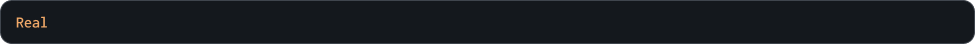

### `GetYscale`

Метод возвращает множитель растяжения по вертикали экземпляра управляемой последовательности, аналогично значению `image_yscale` у объектов

### Синтаксис

```c#
SEQMotion.GetYscale( _seqmotion_sequence_id )
```

### Параметры метода


### Возвращаемое значение



<br>
<br>

### Пример

```c#
Object_Eyes.image_xscale = SEQMotion.GetXscale( character );
Object_Eyes.image_yscale = SEQMotion.GetYscale( character );
```

Приведенный выше код получит значения множителей растяжения экземпляра управляемой последовательности и на их основе изменит значения переменных `image_xscale` и `image_yscale` у объекта `Object_Eyes`
