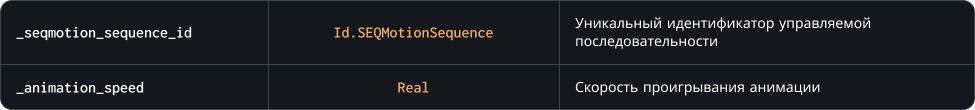

### `SetAnimationSpeed`

Метод позволяет изменить множитель скорости проигрывания анимации<br>
`Внимание!` Множитель скорости проигрывания анимации и значение **playback-скорости** в редакторе последовательностей это разные значения

### Синтаксис

```c#
SEQMotion.SetAnimationSpeed( _seqmotion_sequence_id, _animation_speed )
```

### Параметры метода



### Возвращаемое значение


### Пример

```c#
if ( keyboard_check_pressed( vk_escape ) ) SEQMotion.SetAnimationSpeed( character, 0 );
```

Приведенный выше код проверит, если клавиша `Escape` была нажата, то игра остановит проигрывание анимации экземпляра управляемой последовательности `character`
