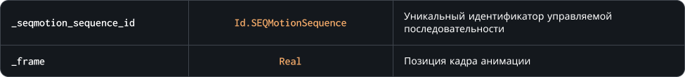

### `SetFrame`

С помощью этого метода вы можете изменить позицию текущего кадра анимации, аналогично с `image_index` для спрайтов

### Синтаксис

```c#
SEQMotion.SetFrame( _seqmotion_sequence_id, _frame )
```

### Параметры метода



### Возвращаемое значение


<br>
<br>

### Пример

```c#
animation_index ++;
SEQMotion.SetFrame( character, animation_index );
```

Приведенный выше код реализует свою систему обновления анимации управляемой последовательности `character`
