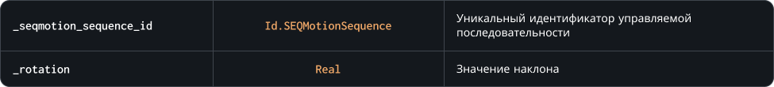

### `SetRotation`

С помощью этого метода вы можете изменить угол наклона экземпляра управляемой последовательности, аналогично с `image_angle` для спрайтов.
Изменение наклона также влияет на положение [локаторов](/)

### Синтаксис

```c#
SEQMotion.SetRotation( _seqmotion_sequence_id, _rotation )
```

### Параметры метода



### Возвращаемое значение


<br>
<br>

### Пример

```c#
SEQMotion.SetRotation( hands, point_direction( x, y, mouse_x, mouse_y ) );
```

Приведенный выше код будет направлять экземпляр управляемой последовательности `hands` в сторону курсора игрока
