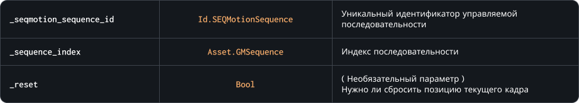

### `SetSequence`

Этот метод позволяет на ходу изменять индекс текущей последовательности экземпляра управляемой последовательности, позволяя вам переключаться между несколькими анимациями, описанными как отдельные ассеты<br>
Параметр `_reset` отвечает за то, нужно ли сбрасывать позицию кадра при смене индекса последовательности. Если этот параметр равен `true`, позиция кадра будет сдвинута в начало — на нулевой индекс ( По умолчанию этот параметр имеет значение `true` )

### Синтаксис

```c#
SEQMotion.SetSequence( _seqmotion_sequence_id, _sequence_index, [ _reset ] )
```

### Параметры метода



### Возвращаемое значение


<br>
<br>

### Пример

```c#
if ( keyboard_check( vk_right ) )
{
	x += 5;
	SEQMotion.SetSequence( character, Sequence_Character_Run, false );
};
```

При нажатии клавиши 'вправо', игра начнет перемещать экземпляр объекта и будет менять индекс его текущей последовательности для изменения анимации без сброса позиции текущего кадра
