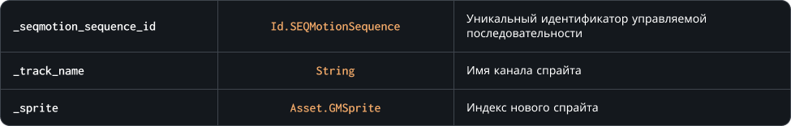

### `SetTrackSprite`

С помощью этого метода можно на ходу изменить индекс спрайта указанного канала экземпляра управляемой последовательности. 
Если канала с указанным именем не существует, игра НЕ вызовет ошибку, позволяя избежать непредвиденных ситуаций

### Синтаксис

```c#
SEQMotion.SetTrackSprite( _seqmotion_sequence_id, _track_name, _sprite )
```

### Параметры метода



### Возвращаемое значение


<br>
<br>

### Пример

```c#
selected_skin = 0;
skin_types =
[
	Sprite_Character_Fox,
	Sprite_Character_Dog,
	Sprite_Character_Jay
];

SEQMotion.SetTrackSprite( character, "Skin", skin_types[ selected_skin ] );
```

Код выше подготовит массив возможных скинов персонажа и будет менять спрайт последовательности на ходу, относительно значения `selected_skin`
