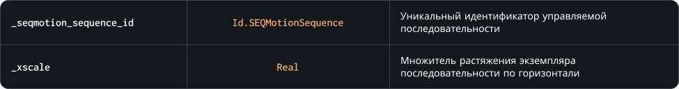

### `SetXscale`

Метод изменяет значение растяжения экземпляра управляемой последовательности по горизонтали, аналогично переменной `image_xscale` у объектов

### Синтаксис

```c#
SEQMotion.SetXscale( _seqmotion_sequence_id, _xscale )
```

### Параметры метода



### Возвращаемое значение


<br>
<br>

### Пример

```c#
SEQMotion.SetXscale( character, image_xscale );
SEQMotion.SetYscale( character, image_yscale );
```

Код выше будет синхронизировать растяжения экземпляра управляемой последовательности по горизонтали и вертикали на основе значений переменных `image_xscale` и `image_yscale` экземпляра объекта
