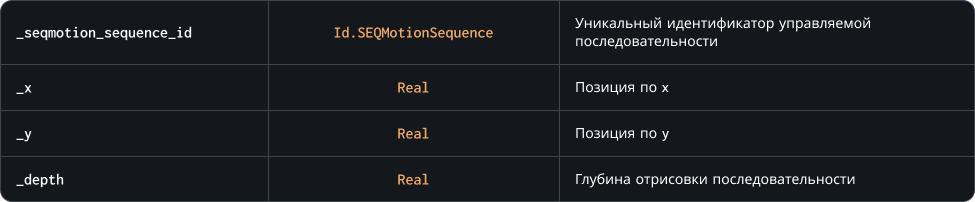

### `UpdateSequence`

Обновление экземпляра управляемой последовательности. Метод изменяет позицию и глубину отрисовки указанного экземпляра. Если параметры `_x`, `_y` и `_depth` не заданы или в качестве значения указана константа `undefined`, игра будет использовать данные экземпляра предыдущего кадра, когда был вызван метод

### Синтаксис

```c#
SEQMotion.UpdateSequence( _seqmotion_sequence_id, [ _x ], [ _y ], [ _depth ] )
```

### Параметры метода



### Возвращаемое значение


### Пример

```c#
SEQMotion.UpdateSequence( character, undefined, y );
```

Код выше обновит позицию экземпляра по вертикали, при этом позиция по горизонтали и глубина отрисовки будут неизменны относительно значений предыдущего кадра, когда был вызван метод
